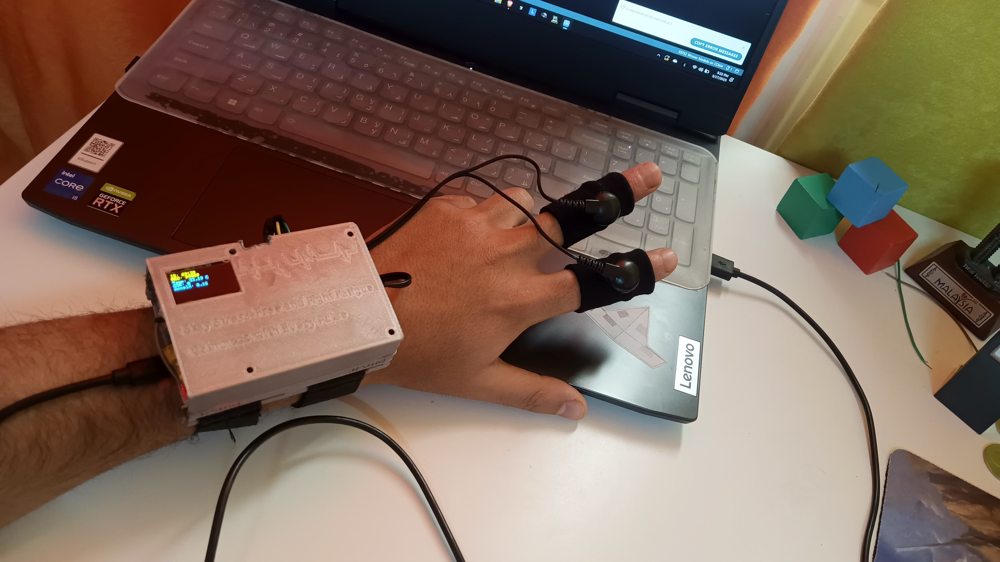
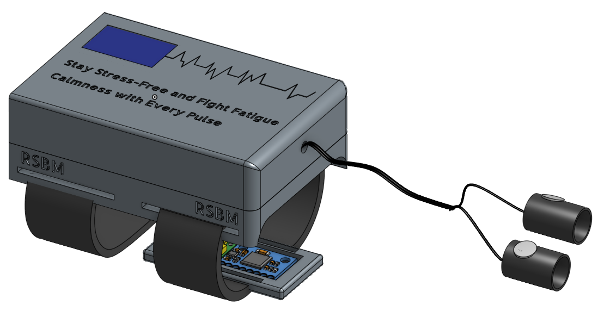
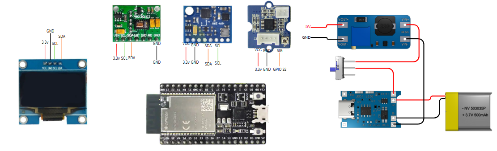
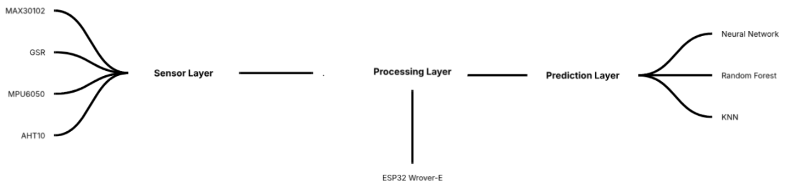
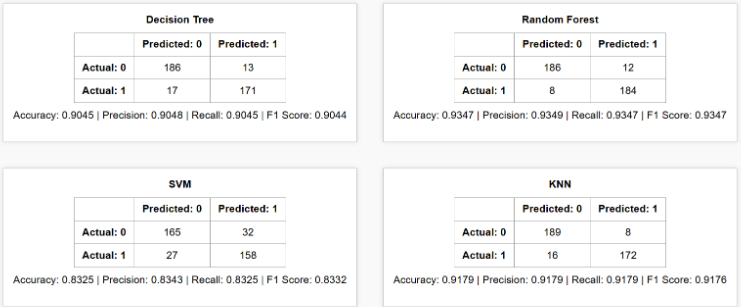

# IoT-Based Wearable Device for Detection and Prediction of Stress and Fatigue

A fully self-developed wearable device that monitors heart rate, blood oxygen, temperature, skin conductance, and movement to detect and predict stress and fatigue in real time. This work was done as part of an academic research project and includes complete hardware, firmware, and analytical models.

> 🔧 **The entire project was built from scratch by our team, including the device, enclosure, system logic, and the research paper itself. We hope this contribution spreads quickly and supports future innovation in wearable health monitoring.**

---

## 📷 Project Images

| Description            | Preview                         |
|------------------------|----------------------------------|
| Real device            |  |
| 3D enclosure (Onshape) | [🔗 View in Onshape](https://cad.onshape.com/documents/06cdc7dd5103108a69db4e8a/w/211ee07450a886f82c94ec0d/e/52509525729491b1b0272fd0?renderMode=0&uiState=684883af258f687a56d25b3e) |
| 3D interactive model   | [🔗 View on Sketchfab](https://skfb.ly/pxyU9) |
| 3D render              |  |
| Wiring diagram         |  |

---

## 👨‍💻 What We Built

- ✅ Custom-designed wearable device (ESP32 + 4 biosensors)
- ✅ 3D-printed enclosure (self-modeled)
- ✅ Real-time Bluetooth and OLED output
- ✅ Step counting and biometric aggregation
- ✅ Manual experiment with 14 students (relaxation, stress, fatigue)
- ✅ Machine learning analysis (Random Forest, KNN, SVM)
- ✅ Paper written and submitted by us (PDF available upon request)

---

## 🧩 Hardware Components

| Component   | Purpose                                |
|------------|-----------------------------------------|
| ESP32       | Central microcontroller + Bluetooth     |
| MAX30102    | Heart rate & SpO2 sensor                |
| MPU6050     | Motion sensor for step/activity         |
| GSR Sensor  | Skin conductance (EDA)                  |
| SSD1306 OLED| Displays metrics on device              |
| Power Supply| Battery + 3D-printed case               |

---

## 🧠 System Architecture

- **Sensor Layer**: Collects biometric signals
- **Processing Layer**: Reads, averages, filters
- **Prediction Layer**: For offline ML model usage

---

---

## 📊 Machine Learning Results

- **Random Forest**: 93.47%
- **KNN**: 91.79%
- **SVM**: 83.25%

📈 Analysis visuals:
- 
- 

---

## 📬 Team Members

- **Sami Sa’ed** – CyberSecurity 
- **Randa Qeisieh** – Computer Information Systems  
- **Baha’a Jaber** – Computer Information Systems  
- **Mohammed Jebreen** – CyberSecurity  
- **Dr. Khalid Alemerien** – Supervisor

---

## ⚠️ License

This repository is for **educational and academic use only**. If you wish to reuse this work for research, teaching, or extension, please contact us directly.

